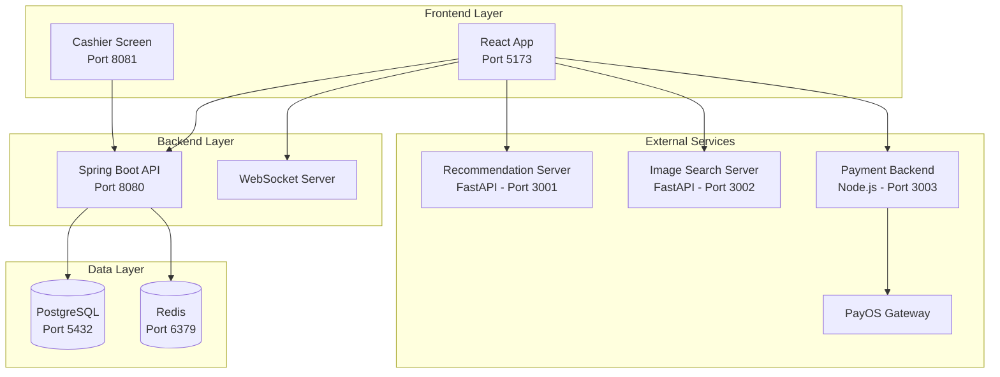
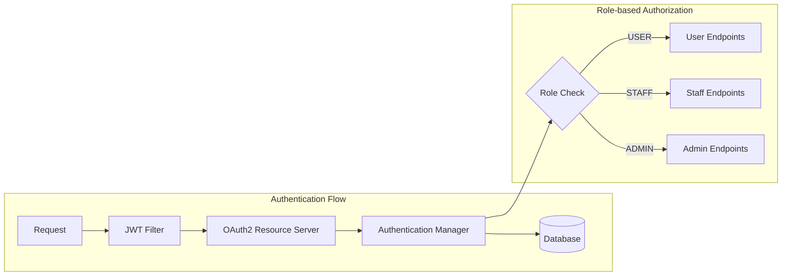
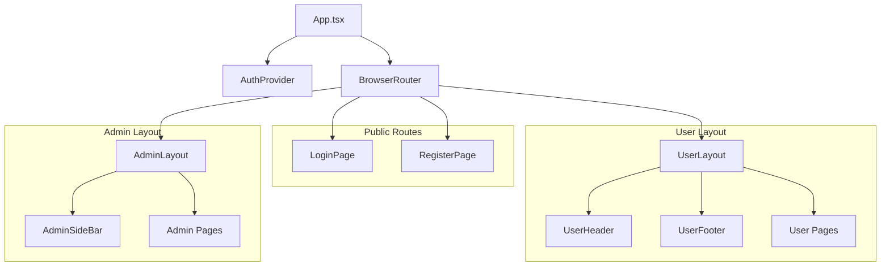
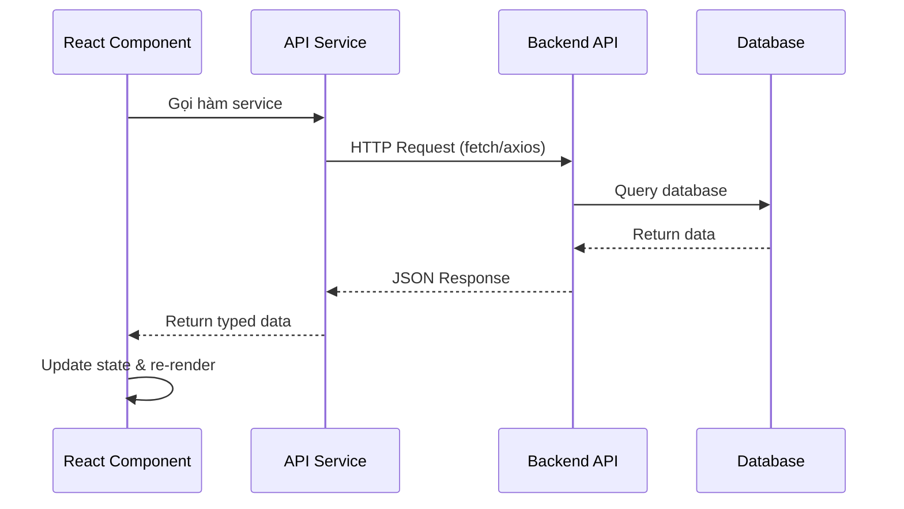
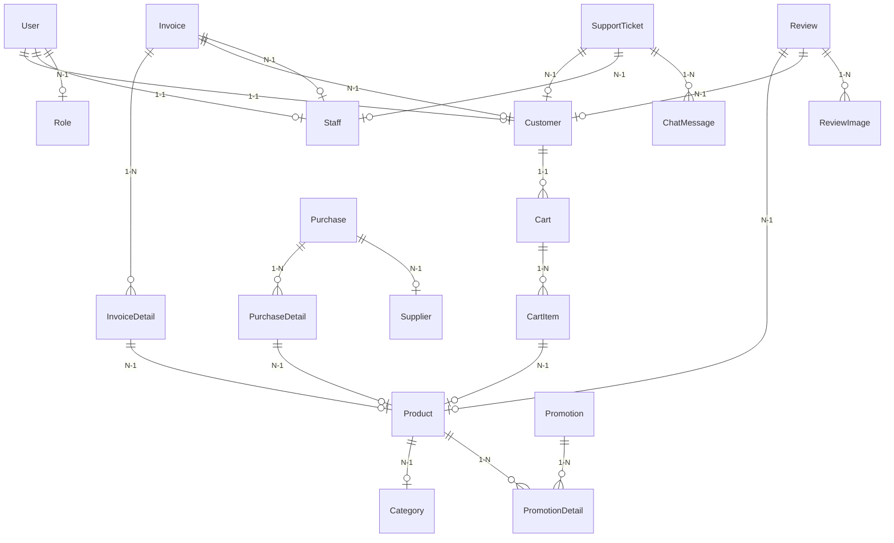

# Kiến trúc tổng thể HappyPetShop

## 1. Kiến trúc tổng quan

Hệ thống HappyPetShop được xây dựng theo mô hình **Client-Server** với backend là monolithic Spring Boot kết hợp với các microservices phụ trợ.

### 1.1. Các thành phần chính

| Thành phần | Công nghệ | Port | Mô tả |
|-----------|-----------|------|-------|
| Frontend | React + TypeScript + Vite | 5173 | Giao diện người dùng |
| Backend | Spring Boot 3 + Java 17 | 8080 | API server chính |
| PostgreSQL | PostgreSQL 16 | 5432 | Database chính |
| Redis | Redis | 6379 | Cache & session |
| Recommendation Server | FastAPI + Python | 3001 | Gợi ý sản phẩm AI |
| Image Search Server | FastAPI + Python | 3002 | Tìm kiếm hình ảnh AI |
| Payment Backend | Node.js + Express | 3003 | Thanh toán PayOS |
| Cashier Screen | Spring Boot | 8081 | Màn hình thu ngân |

### 1.2. Sơ đồ kiến trúc



## 2. Kiến trúc Backend (Spring Boot)

### 2.1. Cấu trúc layer

```
Controller (REST API)
    ↓
Service (Business Logic)
    ↓
Repository (Data Access)
    ↓
Entity (JPA / Database)
```

### 2.2. Security Architecture



- **JWT Token**: Sử dụng Nimbus JOSE + JWT
- **OAuth2 Resource Server**: Spring Security OAuth2
- **Roles**: USER, STAFF, ADMIN (định nghĩa trong `UserRole.java`)
- **Endpoints**: Public endpoints được cấu hình trong `SecurityConfig.java`

### 2.3. Các configuration chính

| File | Mô tả |
|------|-------|
| `SecurityConfig.java` | Cấu hình bảo mật, JWT filter, CORS |
| `WebSocketConfig.java` | Cấu hình WebSocket cho chat |
| `RedisConfig.java` | Cấu hình Redis caching |
| `JacksonConfig.java` | Cấu hình JSON serialization |
| `OpenApiConfig.java` | Cấu hình Swagger/OpenAPI |
| `OAuth2SuccessHandler.java` | Xử lý OAuth2 login thành công |

## 3. Kiến trúc Frontend (React)

### 3.1. Component Tree



### 3.2. Data Flow



## 4. Database Schema

### 4.1. Core Entities



### 4.2. Danh sách entities

| Entity | Table | Mô tả |
|--------|-------|-------|
| User | users | Người dùng (base) |
| Customer | customers | Khách hàng |
| Staff | staffs | Nhân viên |
| Role | roles | Vai trò |
| Product | products | Sản phẩm |
| Pet | pets | Thú cưng |
| Category | categories | Danh mục |
| Cart | carts | Giỏ hàng |
| CartItem | cart_items | Chi tiết giỏ hàng |
| Invoice | invoices | Hoá đơn |
| InvoiceDetail | invoice_details | Chi tiết hoá đơn |
| Purchase | purchases | Phiếu nhập |
| PurchaseDetail | purchase_details | Chi tiết phiếu nhập |
| Supplier | suppliers | Nhà cung cấp |
| Promotion | promotions | Khuyến mãi |
| PromotionDetail | promotion_details | Chi tiết khuyến mãi |
| Review | reviews | Đánh giá |
| ReviewImage | review_images | Hình ảnh đánh giá |
| SupportTicket | support_tickets | Ticket hỗ trợ |
| ChatMessage | chat_messages | Tin nhắn chat |
| InvalidatedToken | invalidated_tokens | Token đã logout |

## 5. External Services

### 5.1. Recommendation Server (FastAPI - Port 3001)

- **Model**: ALS (Alternating Least Squares) + Content-based + Hybrid
- **Endpoints**:
  - `GET/POST /api/v1/recommendations` - Gợi ý hybrid
  - `POST /api/v1/recommendations/similar-products` - Sản phẩm tương tự
  - `POST /api/v1/recommendations/similar-pets` - Thú cưng tương tự
  - `POST /api/v1/recommendations/search` - Tìm kiếm ngữ nghĩa
  - `POST /api/v1/train` - Train model
  - `POST /api/v1/sync` - Đồng bộ dữ liệu

### 5.2. Image Search Server (FastAPI - Port 3002)

- **Model**: CLIP (ViT-B/32) qua sentence-transformers
- **Endpoints**:
  - `POST /api/v1/search/image` - Tìm bằng file ảnh
  - `POST /api/v1/search/image-url` - Tìm bằng URL ảnh
  - `POST /api/v1/search/text` - Tìm bằng text
  - `POST /api/v1/index/rebuild` - Rebuild index

### 5.3. Payment Backend (Node.js - Port 3003)

- **Gateway**: PayOS
- **Endpoints**:
  - `POST /api/payment/create` - Tạo link thanh toán
  - `GET /api/payment/status/:orderId` - Kiểm tra trạng thái
  - `POST /api/payment/cancel/:orderId` - Huỷ thanh toán
  - `POST /api/payment/refund` - Hoàn tiền

## 6. API Design

### 6.1. Response Format

```json
{
    "success": true,
    "data": {},
    "message": "Success message"
}
```

### 6.2. Error Format

```json
{
    "success": false,
    "data": null,
    "message": "Error message"
}
```

### 6.3. Authentication

- Header: `Authorization: Bearer <token>`
- Token type: JWT
- Token storage: localStorage (key: `authToken`)

## 7. Caching Strategy

- **Redis** được sử dụng cho:
  - Session management
  - Cache dữ liệu dashboard
  - Cache kết quả recommendation
- **Cache keys**: Được quản lý qua `RedisConfig.java`

## 8. Migration Strategy

- Sử dụng **Flyway** cho database migration
- Các file migration: `V1__create_tables.sql` đến `V9__add_image_url_to_chat_messages.sql`
- Tự động chạy khi ứng dụng khởi động
