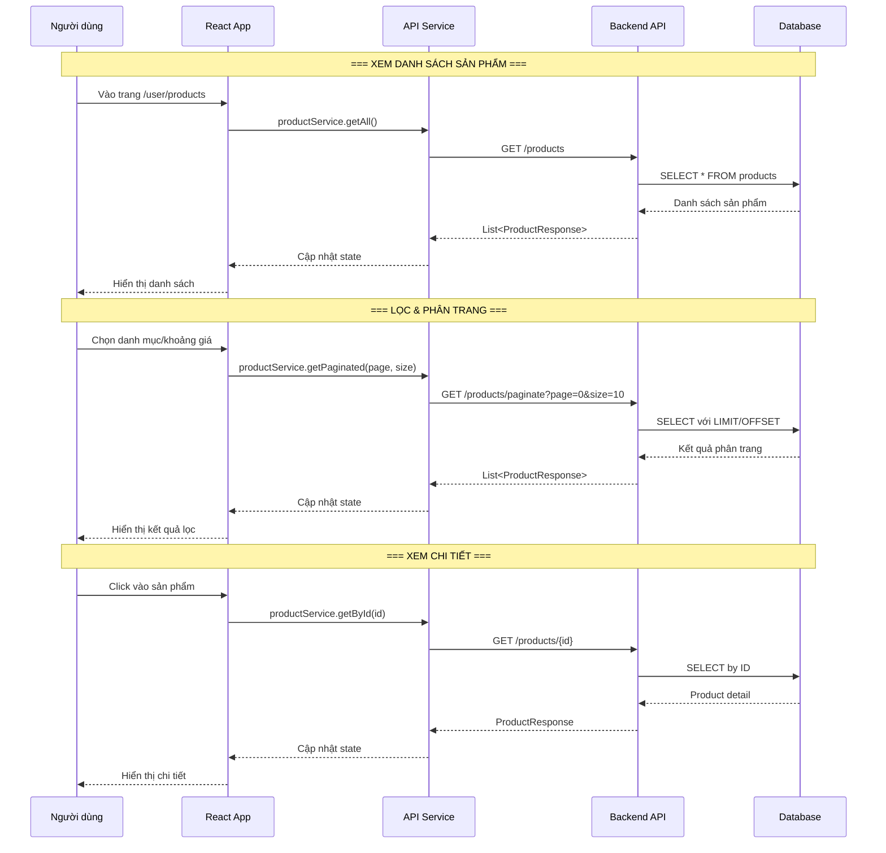

# Luồng duyệt sản phẩm & Thú cưng (Product Browsing Flow)

## 1. Mô tả chức năng

Cho phép người dùng xem danh sách sản phẩm, thú cưng, lọc theo danh mục/giá, phân trang, và xem chi tiết sản phẩm.

## 2. Sơ đồ luồng



## 3. Các trang/component liên quan

### Frontend
| File | Mô tả |
|------|-------|
| `src/pages/user/ProductsPage/ProductsPage.tsx` | Trang danh sách sản phẩm |
| `src/pages/user/AllProductsPage/AllProductsPage.tsx` | Trang tất cả sản phẩm |
| `src/pages/user/DetailedProductPage/DetailedProductPage.tsx` | Trang chi tiết sản phẩm |
| `src/pages/user/PetsPage/PetsPage.tsx` | Trang danh sách thú cưng |
| `src/pages/user/PetsPage/components/PetDetailModal.tsx` | Modal chi tiết thú cưng |
| `src/pages/user/ProductsPage/components/ProductCard.tsx` | Card sản phẩm |
| `src/pages/user/ProductsPage/components/CategoryFilter.tsx` | Bộ lọc danh mục |
| `src/pages/user/ProductsPage/components/PriceFilter.tsx` | Bộ lọc giá |
| `src/pages/user/ProductsPage/components/Pagination.tsx` | Phân trang |
| `src/pages/user/ProductsPage/hooks/useProductManager.ts` | Hook quản lý sản phẩm |
| `src/services/productService.ts` | Service gọi API product |
| `src/services/petService.ts` | Service gọi API pet |
| `src/services/categoryService.ts` | Service gọi API category |

### Backend
| File | Mô tả |
|------|-------|
| `controller/ProductController.java` | REST controller product |
| `controller/PetController.java` | REST controller pet |
| `controller/CategoryController.java` | REST controller category |
| `service/ProductService.java` | Business logic product |
| `service/PetService.java` | Business logic pet |
| `service/CategoryService.java` | Business logic category |
| `entity/Product.java` | Entity sản phẩm |
| `entity/Pet.java` | Entity thú cưng |
| `entity/Category.java` | Entity danh mục |

## 4. API Endpoints

### 4.1. Sản phẩm
```
GET /products                          # Lấy tất cả sản phẩm
GET /products/{id}                     # Lấy sản phẩm theo ID
GET /products/paginate?page=0&size=10  # Phân trang
POST /products                         # Tạo sản phẩm (ADMIN)
PUT /products/{id}                     # Cập nhật sản phẩm (ADMIN)
DELETE /products/{id}                  # Xoá sản phẩm (ADMIN)
```

### 4.2. Thú cưng
```
GET /pets                              # Lấy tất cả thú cưng
GET /pets/{id}                         # Lấy thú cưng theo ID
GET /pets/paginate?page=0&size=10      # Phân trang
POST /pets                             # Tạo thú cưng (ADMIN)
PUT /pets/{id}                         # Cập nhật thú cưng (ADMIN)
DELETE /pets/{id}                      # Xoá thú cưng (ADMIN)
PATCH /pets/{id}/sold                  # Đánh dấu đã bán
```

### 4.3. Danh mục
```
GET /categories                        # Lấy tất cả danh mục
GET /categories/{id}                   # Lấy danh mục theo ID
POST /categories                       # Tạo danh mục (ADMIN)
PUT /categories/{id}                   # Cập nhật danh mục (ADMIN)
```

## 5. Luồng xử lý chi tiết

### 5.1. Xem danh sách sản phẩm
1. User vào trang `/user/products`
2. `ProductsPage` gọi `useProductManager` hook
3. Hook gọi `productService.getAll()` → `GET /products`
4. Backend `ProductController.getAllProducts()` → `ProductService.getAllProducts()`
5. Service query database, trả về danh sách `ProductResponse`
6. Frontend render danh sách qua component `ProductCard`

### 5.2. Lọc và phân trang
1. User chọn danh mục hoặc khoảng giá
2. `CategoryFilter`/`PriceFilter` cập nhật filter state
3. `useProductManager` gọi `productService.getPaginated(page, size)`
4. Backend trả về danh sách đã lọc + phân trang
5. `Pagination` component hiển thị các nút trang

### 5.3. Xem chi tiết sản phẩm
1. User click vào sản phẩm → navigate đến `/user/detailedProduct/{id}`
2. `DetailedProductPage` gọi `productService.getById(id)`
3. Hiển thị thông tin chi tiết: hình ảnh, giá, mô tả, đánh giá
4. Component `ReviewSection` hiển thị các đánh giá
5. Component `RecommendationSection` hiển thị gợi ý
