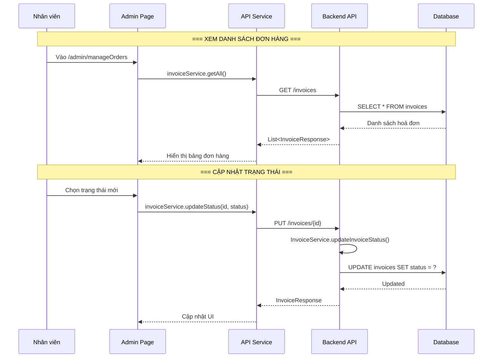

# Luồng quản lý đơn hàng (Order Management Flow)

## 1. Mô tả chức năng

Cho phép nhân viên/admin xem danh sách đơn hàng, cập nhật trạng thái đơn hàng (xác nhận, đang giao, đã giao, đã huỷ).

## 2. Sơ đồ luồng



## 3. Các trang/component liên quan

### Frontend
| File | Mô tả |
|------|-------|
| `src/pages/admin/ManageOrdersPage/ManageOrdersPage.tsx` | Trang quản lý đơn hàng |
| `src/pages/admin/ManageOrdersPage/useManageOrders.ts` | Hook xử lý |

### Backend
| File | Mô tả |
|------|-------|
| `controller/InvoiceController.java` | REST controller invoice |
| `service/InvoiceService.java` | Business logic invoice |
| `entity/Invoice.java` | Entity hoá đơn |
| `entity/InvoiceDetail.java` | Entity chi tiết hoá đơn |

## 4. API Endpoints

```
GET /invoices                          # Lấy tất cả hoá đơn
GET /invoices/{id}                     # Lấy chi tiết hoá đơn
PUT /invoices/{id}                     # Cập nhật trạng thái
DELETE /invoices/{id}                  # Xoá hoá đơn
```

## 5. Trạng thái hoá đơn

| Trạng thái | Mô tả |
|-----------|-------|
| PENDING | Chờ xác nhận |
| CONFIRMED | Đã xác nhận |
| SHIPPING | Đang giao hàng |
| DELIVERED | Đã giao hàng |
| CANCELLED | Đã huỷ |
| REFUNDED | Đã hoàn tiền |
