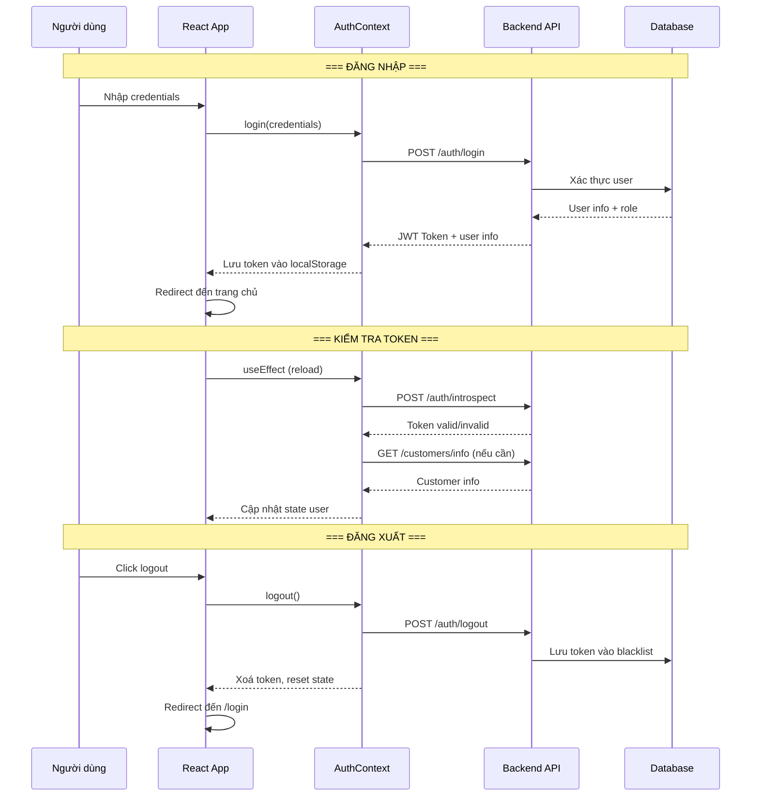

# Luồng xác thực & Phân quyền (Authentication Flow)

## 1. Mô tả chức năng

Hệ thống hỗ trợ xác thực người dùng qua JWT (JSON Web Token) với 3 vai trò: **USER**, **STAFF**, **ADMIN**. Người dùng có thể đăng nhập, đăng ký, đăng xuất và refresh token.

## 2. Sơ đồ luồng



## 3. Các trang/component liên quan

### Frontend
| File | Mô tả |
|------|-------|
| `src/pages/LoginPage/LoginPage.tsx` | Trang đăng nhập |
| `src/pages/LoginPage/useLogin.ts` | Hook xử lý đăng nhập |
| `src/pages/user/RegisterPage/RegisterPage.tsx` | Trang đăng ký |
| `src/context/authContext.tsx` | Context quản lý auth state |
| `src/services/authService.ts` | Service gọi API auth |
| `src/utils/storageUtils.ts` | Utility lưu token |

### Backend
| File | Mô tả |
|------|-------|
| `controller/AuthController.java` | REST controller auth |
| `service/AuthService.java` | Business logic auth |
| `configuration/SecurityConfig.java` | Cấu hình bảo mật |
| `configuration/CustomJWTDecoder.java` | JWT decoder |
| `configuration/OAuth2SuccessHandler.java` | OAuth2 success handler |
| `entity/User.java` | Entity người dùng |
| `entity/Role.java` | Entity vai trò |
| `entity/InvalidatedToken.java` | Token đã logout |

## 4. API Endpoints

### 4.1. Đăng nhập
```
POST /auth/login
Content-Type: application/json

Request:
{
    "username": "string",
    "password": "string"
}

Response (200):
{
    "success": true,
    "data": {
        "token": "jwt_token_string",
        "authenticated": true,
        "user": {
            "id": "uuid",
            "username": "string",
            "role": "USER|STAFF|ADMIN"
        }
    },
    "message": "login successfully"
}
```

### 4.2. Đăng ký
```
POST /auth/register
Content-Type: application/json

Request:
{
    "username": "string",
    "password": "string",
    "email": "string",
    "fullName": "string",
    "phone": "string",
    "address": "string"
}

Response (200): Tương tự login
```

### 4.3. Kiểm tra token
```
POST /auth/introspect
Content-Type: application/json

Request:
{
    "token": "jwt_token_string"
}

Response (200):
{
    "success": true,
    "data": {
        "valid": true
    },
    "message": "Introspect successfully"
}
```

### 4.4. Đăng xuất
```
POST /auth/logout
Content-Type: application/json

Request:
{
    "token": "jwt_token_string"
}

Response (200):
{
    "success": true,
    "data": null,
    "message": "Logout successfully"
}
```

### 4.5. Refresh token
```
POST /auth/refresh
Content-Type: application/json

Request:
{
    "token": "jwt_token_string"
}

Response (200): Token mới
```

## 5. Luồng xử lý chi tiết

### 5.1. Đăng nhập
1. User nhập username/password trên LoginPage
2. `useLogin` hook gọi `authContext.login()`
3. `AuthContext` gọi `authService.login()` → `POST /auth/login`
4. Backend `AuthController.login()` → `AuthService.authenticate()`
5. `AuthService` kiểm tra credentials trong database
6. Nếu hợp lệ, tạo JWT token và trả về
7. Frontend lưu token vào localStorage (key: `authToken`)
8. Gọi `getInfo()` để lấy thông tin customer
9. Redirect đến trang chủ

### 5.2. Kiểm tra token khi reload
1. App reload → `AuthProvider` useEffect chạy
2. Đọc token từ localStorage
3. Gọi `POST /auth/introspect` để kiểm tra token
4. Nếu token hợp lệ, gọi `GET /customers/info` lấy thông tin
5. Cập nhật state `isAuthenticated` và `user`

### 5.3. Phân quyền
- **USER**: Chỉ truy cập được các route `/user/*`
- **STAFF**: Truy cập được `/admin/*` (quản lý đơn hàng, nhập hàng)
- **ADMIN**: Truy cập tất cả route `/admin/*`

## 6. Security Config

```java
// Các endpoint public (không cần auth)
"/auth/**", "/login", "/register"

// Các endpoint yêu cầu role USER
"/user/**"

// Các endpoint yêu cầu role ADMIN
"/admin/**"

// Các endpoint yêu cầu role STAFF hoặc ADMIN
"/staffs/**"
```
