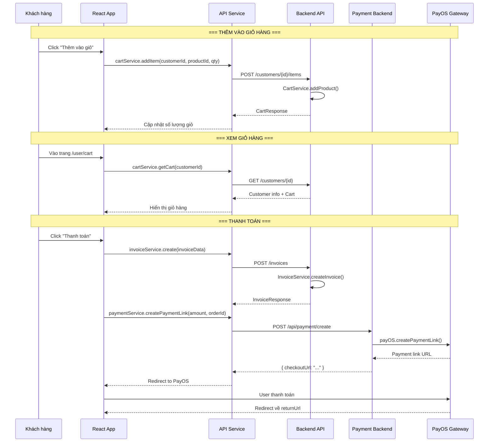

# Luồng giỏ hàng & Thanh toán (Cart & Checkout Flow)

## 1. Mô tả chức năng

Cho phép khách hàng thêm sản phẩm vào giỏ hàng, xem giỏ hàng, tạo hoá đơn và thanh toán qua PayOS.

## 2. Sơ đồ luồng



## 3. Các trang/component liên quan

### Frontend
| File | Mô tả |
|------|-------|
| `src/pages/user/CartPage/CartPage.tsx` | Trang giỏ hàng |
| `src/pages/user/CartPage/useCart.ts` | Hook xử lý giỏ hàng |
| `src/pages/user/PaidInvoicesPage/PaidInvoicesPage.tsx` | Trang hoá đơn đã thanh toán |
| `src/pages/user/PaidInvoicesPage/InvoiceDetailPage.tsx` | Trang chi tiết hoá đơn |
| `src/services/cartService.ts` | Service gọi API cart |
| `src/services/invoiceService.ts` | Service gọi API invoice |
| `src/services/paymentService.ts` | Service gọi API payment |

### Backend
| File | Mô tả |
|------|-------|
| `controller/CustomerController.java` | REST controller customer (cart) |
| `controller/InvoiceController.java` | REST controller invoice |
| `service/CartService.java` | Business logic cart |
| `service/InvoiceService.java` | Business logic invoice |
| `entity/Cart.java` | Entity giỏ hàng |
| `entity/CartItem.java` | Entity chi tiết giỏ hàng |
| `entity/Invoice.java` | Entity hoá đơn |
| `entity/InvoiceDetail.java` | Entity chi tiết hoá đơn |

## 4. API Endpoints

### 4.1. Giỏ hàng
```
POST /customers/{customerId}/items     # Thêm sản phẩm vào giỏ
GET /customers/{id}                    # Lấy thông tin khách hàng (kèm cart)
```

### 4.2. Hoá đơn
```
POST /invoices                         # Tạo hoá đơn mới
GET /invoices                          # Lấy tất cả hoá đơn
GET /invoices/{id}                     # Lấy hoá đơn theo ID
GET /invoices/customer/{id}            # Lấy hoá đơn theo khách hàng
PUT /invoices/{id}                     # Cập nhật trạng thái hoá đơn
DELETE /invoices/{id}                  # Xoá hoá đơn
POST /invoices/review                  # Review hoá đơn
```

## 5. Luồng xử lý chi tiết

### 5.1. Thêm vào giỏ hàng
1. User click "Thêm vào giỏ" trên trang chi tiết sản phẩm
2. Gọi `cartService.addItem(customerId, productId, quantity)`
3. Backend `CustomerController.addProductToCart()` → `CartService.addProduct()`
4. Kiểm tra sản phẩm đã tồn tại trong giỏ chưa
5. Nếu có: tăng số lượng; nếu chưa: thêm mới CartItem
6. Trả về `CartResponse` với tổng số lượng

### 5.2. Tạo hoá đơn và thanh toán
1. User xem giỏ hàng và click "Thanh toán"
2. Frontend gọi `invoiceService.create(invoiceData)` → `POST /invoices`
3. Backend tạo Invoice với status `PENDING`
4. Frontend gọi `paymentService.createPaymentLink()` → Payment Backend
5. Payment Backend tạo link thanh toán qua PayOS
6. User được redirect đến trang thanh toán PayOS
7. Sau khi thanh toán, PayOS redirect về `returnUrl`
8. Frontend kiểm tra trạng thái và cập nhật
