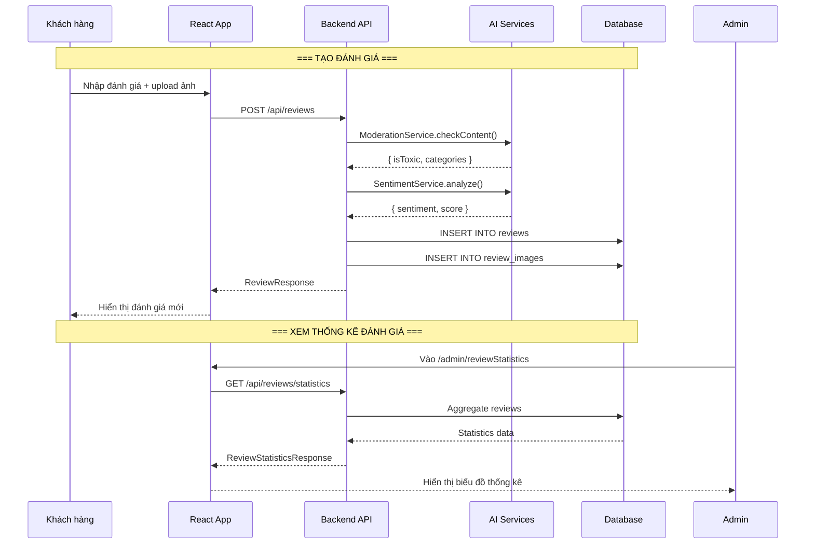

# Luồng đánh giá sản phẩm (Review Flow)

## 1. Mô tả chức năng

Cho phép khách hàng tạo đánh giá cho sản phẩm đã mua, upload hình ảnh. Hệ thống tích hợp AI moderation (kiểm tra nội dung độc hại) và sentiment analysis (phân tích cảm xúc).

## 2. Sơ đồ luồng



## 3. Các trang/component liên quan

### Frontend
| File | Mô tả |
|------|-------|
| `src/pages/user/ReviewPage/ReviewPage.tsx` | Trang tạo đánh giá |
| `src/pages/user/ReviewPage/useReview.ts` | Hook xử lý đánh giá |
| `src/components/ReviewSection.tsx` | Component hiển thị đánh giá |
| `src/pages/admin/ReviewStatisticsPage/ReviewStatisticsPage.tsx` | Thống kê đánh giá |
| `src/services/reviewService.ts` | Service gọi API review |

### Backend
| File | Mô tả |
|------|-------|
| `controller/ReviewController.java` | REST controller review |
| `service/ReviewService.java` | Business logic review |
| `service/ModerationService.java` | Kiểm duyệt nội dung AI |
| `service/ToxicService.java` | Phát hiện nội dung độc hại |
| `service/SentimentService.java` | Phân tích cảm xúc |
| `entity/Review.java` | Entity đánh giá |
| `entity/ReviewImage.java` | Entity hình ảnh đánh giá |
| `repository/ReviewRepository.java` | Repository review |
| `repository/ReviewImageRepository.java` | Repository review image |
| `mapper/ReviewMapper.java` | MapStruct mapper |

## 4. API Endpoints

```
POST /api/reviews                      # Tạo đánh giá mới
GET /api/reviews/product/{productId}   # Lấy đánh giá theo sản phẩm
GET /api/reviews/statistics            # Thống kê đánh giá (ADMIN)
GET /api/reviews/sentiment-stats       # Thống kê sentiment (ADMIN)
```

## 5. Luồng xử lý chi tiết

### 5.1. Tạo đánh giá
1. User nhập nội dung đánh giá, chọn rating, upload ảnh
2. Frontend gọi `POST /api/reviews` với `ReviewCreationRequest`
3. Backend `ReviewController.createReview()` → `ReviewService.createReview()`
4. `ModerationService.checkContent()` kiểm tra nội dung độc hại
5. `SentimentService.analyze()` phân tích cảm xúc (POSITIVE/NEGATIVE/NEUTRAL)
6. Lưu Review vào database với sentiment và moderation result
7. Lưu ReviewImage nếu có upload ảnh
8. Trả về `ReviewResponse`

### 5.2. AI Moderation
- Sử dụng `ToxicService` để phát hiện nội dung độc hại
- Trả về các categories: TOXIC, INSULT, THREAT, IDENTITY_HATE
- Nếu phát hiện toxic, đánh giá có thể bị ẩn hoặc gắn cờ

### 5.3. Sentiment Analysis
- Phân tích cảm xúc của nội dung đánh giá
- Kết quả: POSITIVE, NEGATIVE, NEUTRAL
- Được lưu vào cột `sentiment` trong bảng reviews
