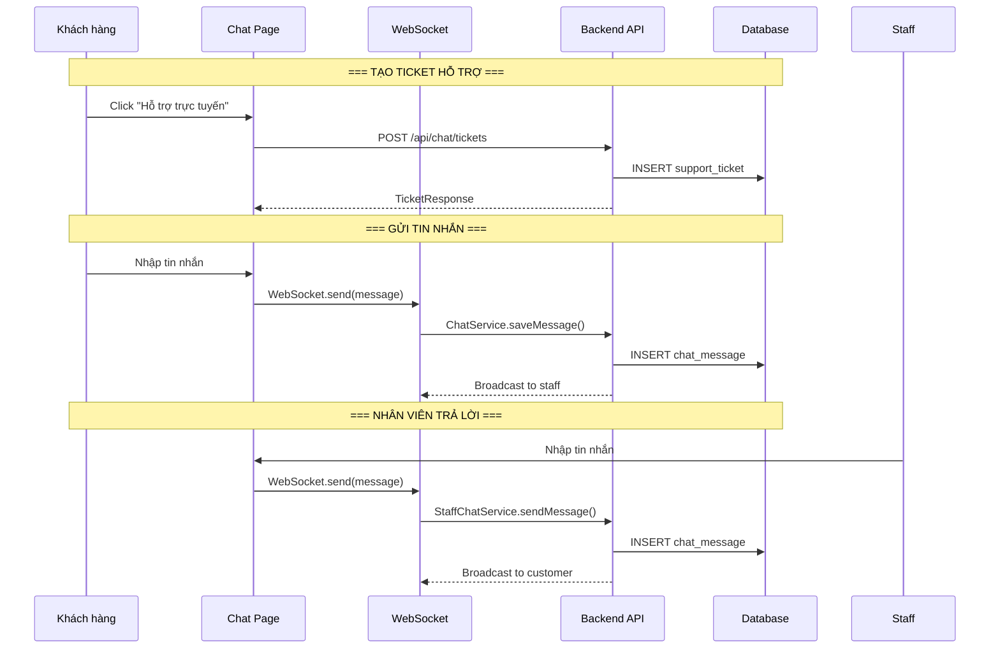

# Luồng hỗ trợ trực tuyến (Chat Support Flow)

## 1. Mô tả chức năng

Hỗ trợ chat real-time giữa khách hàng và nhân viên qua WebSocket. Khách hàng tạo ticket hỗ trợ, nhân viên nhận và trả lời.

## 2. Sơ đồ luồng



## 3. Các trang/component liên quan

### Frontend
| File | Mô tả |
|------|-------|
| `src/pages/user/ChatPage/ChatPage.tsx` | Trang chat khách hàng |
| `src/pages/admin/ChatManagementPage/ChatManagementPage.tsx` | Trang chat nhân viên |
| `src/services/chatService.ts` | Service gọi API chat |
| `src/types/chatTypes.ts` | Type definitions |

### Backend
| File | Mô tả |
|------|-------|
| `controller/ChatController.java` | REST controller chat (user) |
| `controller/StaffChatController.java` | REST controller chat (staff) |
| `service/ChatService.java` | Business logic chat |
| `service/StaffAssignmentService.java` | Phân công nhân viên |
| `configuration/WebSocketConfig.java` | Cấu hình WebSocket |
| `entity/SupportTicket.java` | Entity ticket hỗ trợ |
| `entity/ChatMessage.java` | Entity tin nhắn chat |
| `repository/SupportTicketRepository.java` | Repository ticket |
| `repository/ChatMessageRepository.java` | Repository message |

## 4. API Endpoints

### User endpoints
```
POST /api/chat/tickets                 # Tạo ticket mới
GET /api/chat/tickets/{id}             # Lấy ticket
GET /api/chat/tickets/my-tickets       # Lấy ticket của tôi
POST /api/chat/send                    # Gửi tin nhắn
GET /api/chat/messages/{ticketId}      # Lấy lịch sử tin nhắn
```

### Staff endpoints
```
GET /api/staff/chat/tickets            # Lấy danh sách ticket
PUT /api/staff/chat/tickets/{id}/assign # Nhận ticket
PUT /api/staff/chat/tickets/{id}/close  # Đóng ticket
POST /api/staff/chat/send              # Gửi tin nhắn (staff)
```

## 5. WebSocket Events

```
Client → Server:
- chat.send: Gửi tin nhắn mới

Server → Client:
- chat.message: Tin nhắn mới
- chat.ticket.update: Cập nhật trạng thái ticket
- chat.typing: Đang gõ...
```

## 6. Luồng xử lý chi tiết

### 6.1. Tạo ticket
1. User click "Hỗ trợ trực tuyến" → gọi `POST /api/chat/tickets`
2. Backend tạo `SupportTicket` với status `OPEN`
3. `StaffAssignmentService` tự động gán cho nhân viên khả dụng
4. Trả về `TicketResponse` với thông tin ticket

### 6.2. Gửi tin nhắn
1. User/staff nhập tin nhắn → gửi qua WebSocket
2. Backend lưu `ChatMessage` vào database
3. Broadcast tin nhắn đến các client liên quan
4. Hỗ trợ gửi hình ảnh qua `imageUrl` field
