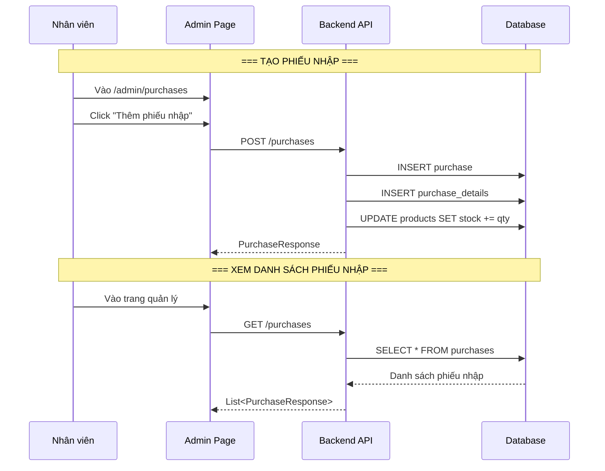

# Luồng nhập hàng & Quản lý kho (Purchase & Stock Flow)

## 1. Mô tả chức năng

Cho phép nhân viên/admin tạo phiếu nhập hàng từ nhà cung cấp, quản lý số lượng tồn kho.

## 2. Sơ đồ luồng



## 3. Các trang/component liên quan

### Frontend
| File | Mô tả |
|------|-------|
| `src/pages/admin/PurchasePage/PurchasePage.tsx` | Trang quản lý phiếu nhập |
| `src/pages/admin/AddPurchasePage/AddPurchasePage.tsx` | Trang thêm phiếu nhập |

### Backend
| File | Mô tả |
|------|-------|
| `controller/PurchaseController.java` | REST controller purchase |
| `service/PurchaseService.java` | Business logic purchase |
| `entity/Purchase.java` | Entity phiếu nhập |
| `entity/PurchaseDetail.java` | Entity chi tiết phiếu nhập |
| `entity/Supplier.java` | Entity nhà cung cấp |

## 4. API Endpoints

```
GET /purchases                          # Lấy tất cả phiếu nhập
GET /purchases/{id}                     # Lấy phiếu nhập theo ID
POST /purchases                         # Tạo phiếu nhập mới
PUT /purchases/{id}                     # Cập nhật phiếu nhập
DELETE /purchases/{id}                  # Xoá phiếu nhập
```

## 5. Luồng xử lý chi tiết

1. Staff vào trang `/admin/purchases`, click "Thêm phiếu nhập"
2. Chọn nhà cung cấp, nhập danh sách sản phẩm + số lượng + giá nhập
3. Gọi `POST /purchases` với danh sách `PurchaseDetail`
4. Backend tạo `Purchase` và `PurchaseDetail`
5. Cập nhật `stock` trong bảng `products` (tăng số lượng tồn kho)
6. Trả về `PurchaseResponse`
