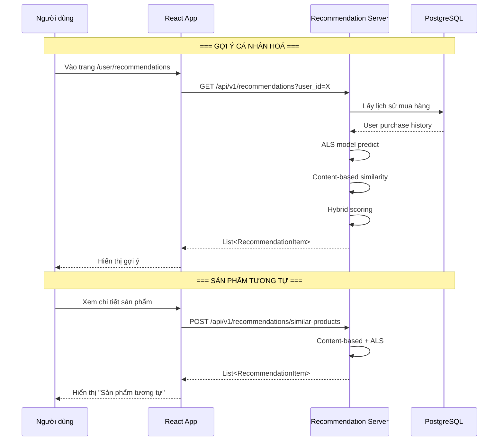

# Luồng gợi ý sản phẩm (AI Recommendation Flow)

## 1. Mô tả chức năng

Hệ thống gợi ý sản phẩm sử dụng mô hình AI kết hợp ALS (Alternating Least Squares) và Content-based filtering để đề xuất sản phẩm/thú cưng phù hợp với người dùng.

## 2. Sơ đồ luồng



## 3. Các trang/component liên quan

### Frontend
| File | Mô tả |
|------|-------|
| `src/pages/user/RecommendationsPage/RecommendationsPage.tsx` | Trang gợi ý |
| `src/components/RecommendationSection.tsx` | Component gợi ý |
| `src/services/recommendationService.ts` | Service gọi API recommendation |

### Recommendation Server (FastAPI)
| File | Mô tả |
|------|-------|
| `app/api/routes.py` | API endpoints |
| `app/models/als.py` | ALS model (Implicit) |
| `app/models/content_based.py` | Content-based (TF-IDF + Cosine) |
| `app/models/hybrid.py` | Hybrid recommender |
| `app/schemas.py` | Request/Response schemas |
| `app/config.py` | Configuration |
| `app/db/postgres_db.py` | Database connection |

## 4. API Endpoints

```
GET /api/v1/recommendations?user_id=X&limit=10
POST /api/v1/recommendations
POST /api/v1/recommendations/similar-products
POST /api/v1/recommendations/similar-pets
POST /api/v1/recommendations/search
POST /api/v1/train
POST /api/v1/sync
```

## 5. Luồng xử lý chi tiết

### 5.1. Gợi ý Hybrid
1. Frontend gọi `GET /api/v1/recommendations?user_id=X`
2. Recommendation Server kết hợp 4 nguồn:
   - **ALS**: Gợi ý dựa trên lịch sử mua hàng (collaborative filtering)
   - **Content-based**: Gợi ý dựa trên đặc điểm sản phẩm
   - **Bestseller**: Sản phẩm bán chạy
   - **Co-purchase**: Sản phẩm thường mua cùng
3. Tính điểm hybrid và trả về danh sách gợi ý

### 5.2. Train Model
1. Admin gọi `POST /api/v1/train`
2. Server đọc dữ liệu từ PostgreSQL
3. Xây dựng content embeddings (TF-IDF)
4. Train ALS model
5. Clear Redis cache
