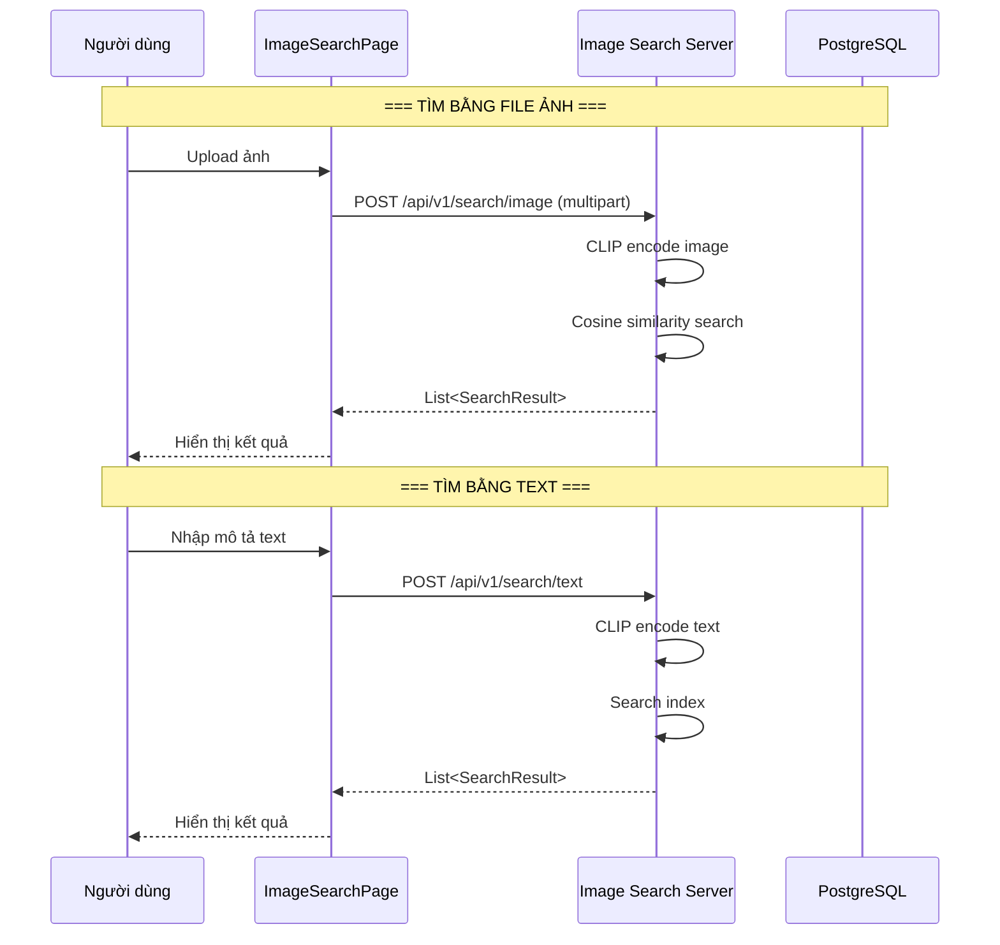

# Luồng tìm kiếm bằng hình ảnh (AI Image Search Flow)

## 1. Mô tả chức năng

Cho phép người dùng tìm kiếm sản phẩm/thú cưng bằng cách upload hình ảnh hoặc nhập URL ảnh, sử dụng mô hình CLIP để tìm các item có hình ảnh tương tự.

## 2. Sơ đồ luồng



## 3. Các trang/component liên quan

### Frontend
| File | Mô tả |
|------|-------|
| `src/pages/user/ImageSearchPage/ImageSearchPage.tsx` | Trang tìm kiếm hình ảnh |
| `src/services/imageSearchService.ts` | Service gọi API image search |

### Image Search Server (FastAPI)
| File | Mô tả |
|------|-------|
| `main.py` | FastAPI app + endpoints |
| `embedding_service.py` | CLIP embedding service |
| `product_service.py` | Product data service |
| `search_service.py` | Search logic |

## 4. API Endpoints

```
POST /api/v1/search/image             # Tìm bằng file ảnh (multipart)
POST /api/v1/search/image-url         # Tìm bằng URL ảnh
POST /api/v1/search/text              # Tìm bằng text description
POST /api/v1/index/rebuild            # Rebuild index
GET /api/v1/stats                     # Index statistics
```

## 5. Luồng xử lý chi tiết

### 5.1. Tìm bằng hình ảnh
1. User upload ảnh (JPEG/PNG) hoặc nhập URL
2. Image Search Server encode ảnh qua CLIP model → vector embedding
3. Tính cosine similarity với tất cả item trong index
4. Trả về top-k kết quả (sản phẩm + thú cưng) có độ tương đồng cao nhất

### 5.2. Tìm bằng text
1. User nhập mô tả (VD: "a brown dog", "cat food")
2. Server encode text qua CLIP text encoder
3. So sánh với index đã có
4. Trả về kết quả phù hợp

### 5.3. Index
- Được xây dựng từ dữ liệu sản phẩm/thú cưng trong PostgreSQL
- Cache trên disk để không cần rebuild mỗi lần khởi động
- Có thể force rebuild qua API
