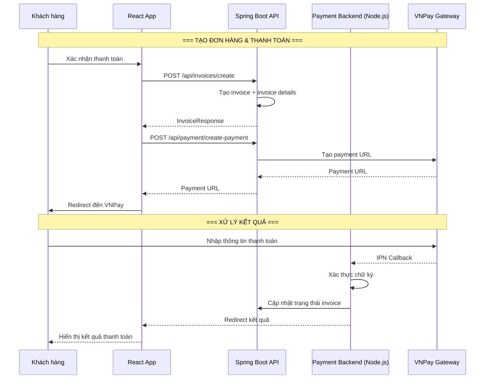

# Luồng thanh toán (Payment Flow)

## 1. Mô tả chức năng

Xử lý thanh toán qua VNPay. Khi user checkout, frontend gọi backend Spring Boot để tạo URL thanh toán VNPay, sau đó redirect user đến cổng thanh toán VNPay. Sau khi thanh toán xong, VNPay gọi callback đến payment backend (Node.js) để xác nhận.

## 2. Sơ đồ luồng



## 3. Các trang/component liên quan

### Frontend
| File | Mô tả |
|------|-------|
| `src/services/paymentService.ts` | Service gọi API payment |

### Backend
| File | Mô tả |
|------|-------|
| `controller/InvoiceController.java` | REST controller invoice |
| `service/InvoiceService.java` | Business logic invoice |
| `service/CartService.java` | Business logic cart |
| `entity/Invoice.java` | Entity hoá đơn |
| `entity/InvoiceDetail.java` | Entity chi tiết hoá đơn |

### Payment Backend (Node.js)
| File | Mô tả |
|------|-------|
| `controllers/payment.controller.js` | Xử lý VNPay IPN callback |

## 4. API Endpoints

```
POST /api/invoices/create              # Tạo hoá đơn
POST /api/payment/create-payment       # Tạo URL thanh toán VNPay
GET /api/payment/vnpay-return          # Xử lý kết quả từ VNPay
POST /api/payment/vnpay-ipn           # IPN callback từ VNPay
GET /api/invoices                      # Lấy danh sách hoá đơn
GET /api/invoices/{id}                 # Lấy chi tiết hoá đơn
```

## 5. Luồng xử lý chi tiết

### 5.1. Tạo đơn hàng
1. User xác nhận giỏ hàng → gọi `POST /api/invoices/create`
2. Backend tạo `Invoice` với status `PENDING`
3. Tạo `InvoiceDetail` từ giỏ hàng
4. Xoá giỏ hàng sau khi tạo thành công

### 5.2. Thanh toán VNPay
1. Gọi `POST /api/payment/create-payment` với invoice ID
2. Backend tạo payment URL với các tham số VNPay
3. Redirect user đến VNPay
4. User nhập thông tin thẻ và xác nhận

### 5.3. Xử lý callback
1. VNPay gửi IPN đến payment backend (Node.js)
2. Payment backend xác thực chữ ký (HMAC-SHA512)
3. Gọi API Spring Boot để cập nhật trạng thái invoice
4. Redirect user về trang kết quả
