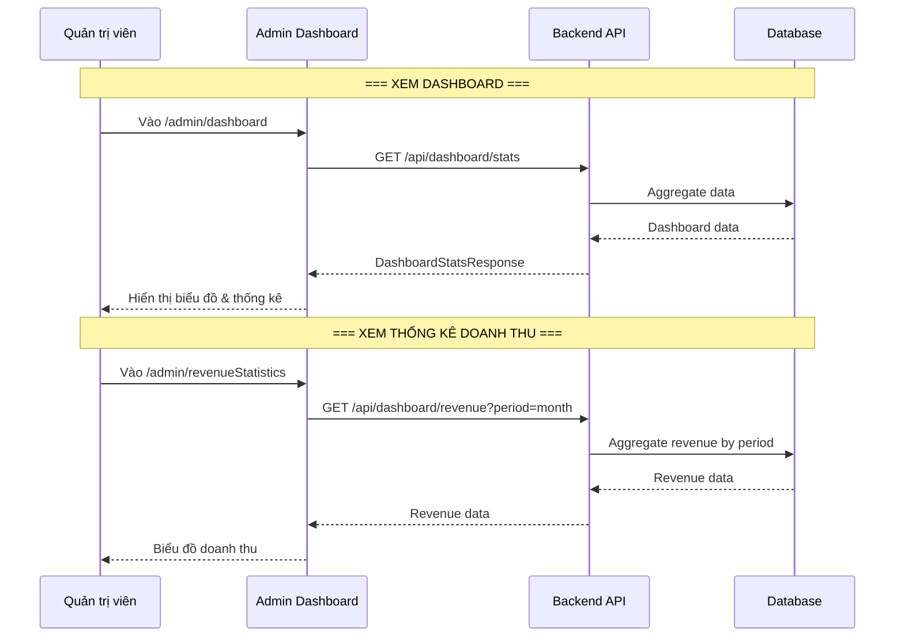

# Luồng thống kê Dashboard (Dashboard Flow)

## 1. Mô tả chức năng

Hiển thị thống kê tổng quan cho admin: doanh thu, đơn hàng, sản phẩm, khách hàng mới, đánh giá gần đây.

## 2. Sơ đồ luồng



## 3. Các trang/component liên quan

### Frontend
| File | Mô tả |
|------|-------|
| `src/pages/admin/DashBoardPage/AdminDashBoard.tsx` | Trang dashboard |
| `src/pages/admin/RevenueStatisticsPage/RevenueStatisticsPage.tsx` | Thống kê doanh thu |
| `src/services/dashboardService.ts` | Service gọi API dashboard |

### Backend
| File | Mô tả |
|------|-------|
| `controller/DashboardController.java` | REST controller dashboard |
| `service/DashboardService.java` | Business logic dashboard |
| `dto/response/DashboardStatsResponse.java` | DTO dashboard stats |

## 4. API Endpoints

```
GET /api/dashboard/stats               # Thống kê tổng quan
GET /api/dashboard/revenue             # Thống kê doanh thu
GET /api/dashboard/revenue-by-date     # Doanh thu theo ngày
```

## 5. Dashboard Stats

```
DashboardStatsResponse:
- totalRevenue: Tổng doanh thu
- totalOrders: Tổng đơn hàng
- totalProducts: Tổng sản phẩm
- totalCustomers: Tổng khách hàng
- newCustomersThisMonth: Khách hàng mới trong tháng
- recentReviews: Đánh giá gần đây
- revenueByPeriod: Doanh thu theo kỳ
```
